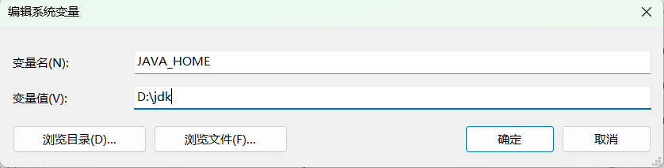

:::tip
相关工具的下载安装与配置
:::

<!-- more -->

## JDK的下载和安装
1. 官网地址 ：[点击跳转](https://www.oracle.com/java/technologies/downloads/#jdk17-windows)
2. 安装jdk17 目前jdk 我们只需要安装长期版本LTS 因为长期维护 下载17是因为可以学习新特性 （8，11，17）
3. jdk应安装在一个纯英文目录下 防止后续不必要的麻烦 例：D:/jdk/
4. 安装完成 测试是否安装成功

```sh
java -version
```

## 配置JDK环境变量
1. 现在JDK版本默认给你添加一个C盘环境变量
2. 但是是阉割版的Java运行文件
3. 为了避免后续出现问题 我们应该删掉默认配置改为手动配置
4. 选择新建系统变量  变量名不要随便改为了迎合其他软件 统一叫做`JAVA_HOME`     变量值无需选到bin目录下

5. path路径引入  `%JAVA_HOME%\bin;`即可 使用这种方式可以避免后续的冲突 
6. 测试添加成功同理
```sh
java -version
```
注意：win8开始会出现环境变量失效问题

解决方法：重新打开环境变量 什么也不需要改 点一下确定即可

## IDEA的下载与安装

懂得都懂下载专业版 社区版狗都不用

1. 官网地址：[点击跳转](https://www.jetbrains.com/idea/)

   历史版本下载：[点击跳转](https://www.jetbrains.com/idea/download/other.html)

2. 个人建议使用 2018 2019 2020 全系版本 我使用的是2020.3.4
3. 选择跟你电脑适配的应用程序 点击下载 下载完以后选择安装
4. 网上很多免费使用到2099年的教程，有钱当我放屁

[教程地址](http://itmooc.tech/19.html)