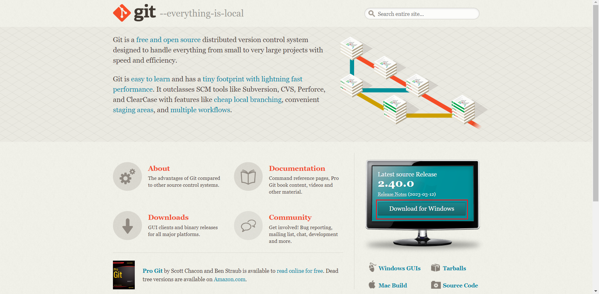
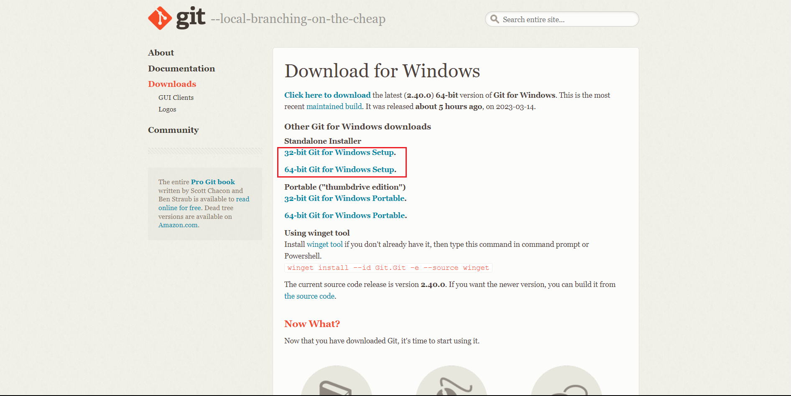
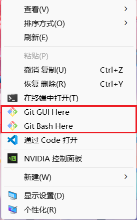

:::tip
Git的下载与安装
:::

<!-- more -->

## 官网地址 ： [点击跳转](https://git-scm.com/)
1. 点击Download

2. 选择对应版本下载

3. 双击安装

4. 右键单击 出现git代表安装成功

## 命令大全

### 设置

* `git config --global user.name "[name]"`：设置您用于提交Git更改时显示的用户名。
* `git config --global user.email "[email address]"`：设置您用于提交Git更改时使用的电子邮件地址。
* `git config --global color.ui auto`：让Git自动着色控制台输出，使其更容易阅读。
* `git config --global core.editor [editor]`：将指定的文本编辑器设置为默认的Git编辑器。

### 基础命令

* `git init`：创建一个新的Git存储库，即使需要时也可以从现有代码中开始。
* `git clone [url]`：从远程Git存储库中克隆项目并在本地计算机上创建副本。
* `git add [file]`：将文件添加到暂存区，以便在下一次提交时包括它们。
* `git add .`：将所有当前文件夹中未跟踪和修改过的文件添加到暂存区。
* `git commit -m "[message]"`：提交所有更改。当使用此命令时，您必须附加一条消息以描述所做的更改。
* `git status`：检查当前工作目录的状态和未提交的更改。
* `git log`：查看提交历史记录并浏览所有已提交的更改。

### 分支和合并

* `git branch`：列出所有可用分支，并告诉您当前正在哪个分支上工作。
* `git branch [branch-name]`：创建具有指定名称的新分支。
* `git checkout [branch-name]`：切换到指定的分支并更新工作目录以反映该分支的内容。
* `git merge [branch-name]`：从指定分支将所有更改合并到当前分支。
* `git branch -d [branch-name]`：删除与指定名称相对应的分支。

### 远程操作

* `git remote add origin [url]`：将远程存储库添加为主要源。
* `git push origin [branch-name]`：将分支推送到远程存储库。
* `git pull`：从远程存储库拉取最新更改并将它们合并到本地项目中。
* `git fetch`：从远程存储库获取最新版本但不会将其合并到您的本地项目中。

### 撤消更改

* `git reset [file]`：取消对指定文件所做的更改。
* `git checkout -- [file]`：撤销对指定文件所做的更改，并还原到上次提交时的状态。
* `git revert [commit]`：撤销指定提交的更改。

### 其他

* `git help`：打开帮助文档以获取有关任何其他Git命令的信息。