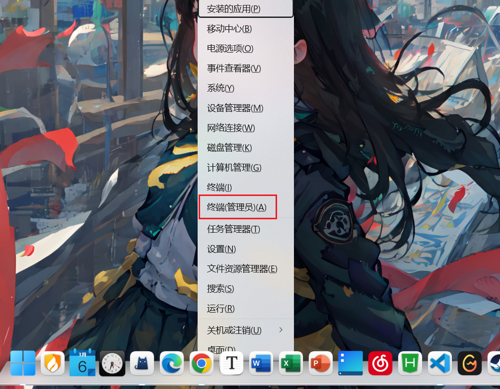
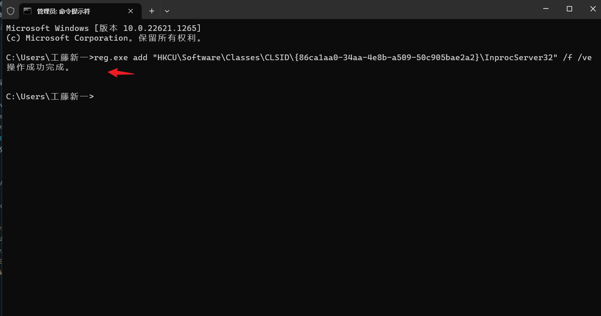
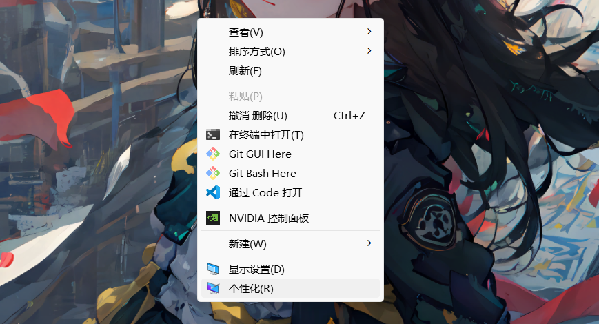

::: tip 摘要
Win11右键菜单默认展开
:::

<!-- more -->
## 修改Win11右键面板
### 打开终端(管理员)
#### 按 Win + x 唤出面板  按A或鼠标点击终端(管理员)


### 输入指令 回车即可
```sh
reg.exe add "HKCU\Software\Classes\CLSID\{86ca1aa0-34aa-4e8b-a509-50c905bae2a2}\InprocServer32" /f /ve
```

### 重启电脑生效



## 恢复Win11右键面板

### 打开终端(管理员)
### 输入指令 回车即可 
```sh
reg.exe delete "HKCU\Software\Classes\CLSID\{86ca1aa0-34aa-4e8b-a509-50c905bae2a2}\InprocServer32" /va /f
```
### 重启电脑即可